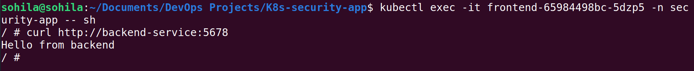
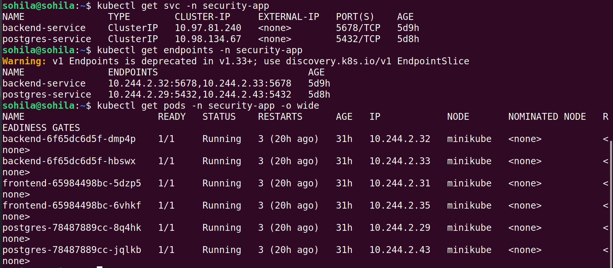
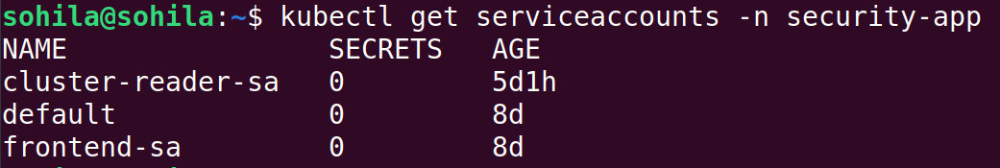
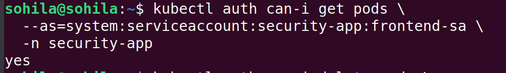
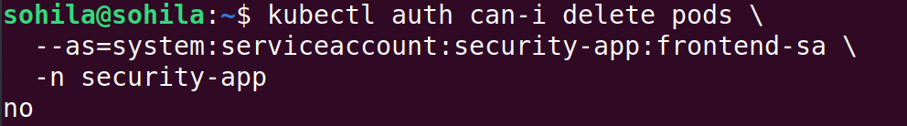
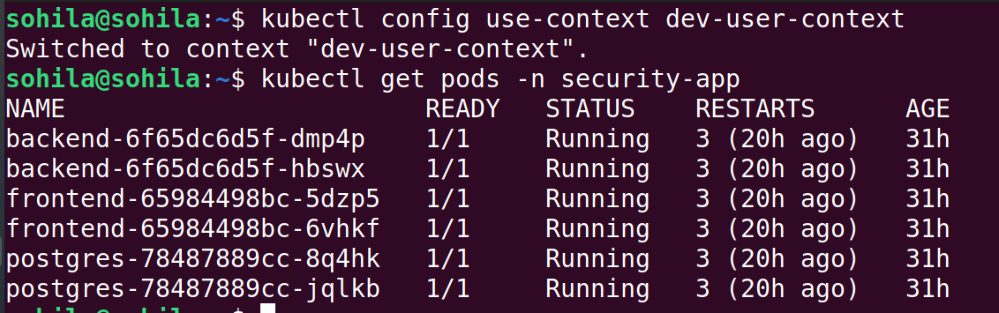
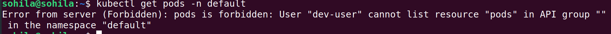
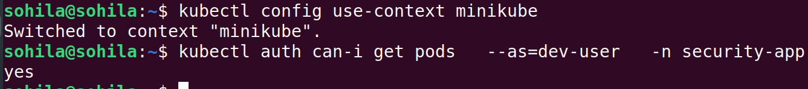
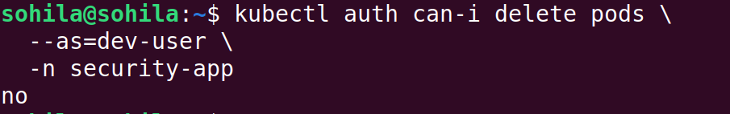

# K8s Security, Storage & Networking Lab

A hands-on Kubernetes administration project built for **CKA preparation** and practical Kubernetes troubleshooting.

The application itself is intentionally simple. The main goal is to demonstrate Kubernetes administration skills through real implementation, testing, failures, troubleshooting, and Verification & Screenshots screenshots.

> **Learning method:** Study → Understand → Implement → Break → Troubleshoot → Explain

---

## 1. Project Overview

**Namespace:** `security-app`
**Main local cluster:** `minikube`

The project contains:

- Frontend using `nginx:alpine`
- Backend using `hashicorp/http-echo:1.0`
- PostgreSQL workload and Service
- Kubernetes Services and DNS
- ServiceAccounts
- RBAC
- KubeConfig
- Client certificate authentication
- Security Context
- Secrets
- NetworkPolicies
- Storage
- Ingress
- Networking troubleshooting

The backend intentionally does **not** connect to PostgreSQL. PostgreSQL is used as a target for Kubernetes networking, authentication, secrets, and storage labs.

---

## 2. Architecture

```text
                         Kubernetes Cluster
                                |
                         security-app namespace
                                |
              +-----------------+-----------------+
              |                 |                 |
         Frontend           Backend          PostgreSQL
        nginx:alpine     http-echo:1.0       PostgreSQL
              |                 |                 |
              |           backend-service       |
              |                 |           postgres-service
              +-----------------+-----------------+
                        Kubernetes DNS
```

---

## 3. Project Structure

```text
.
├── manifests/
│   ├── backend-deployment.yaml
│   ├── backend-service.yaml
│   ├── frontend-deployment.yaml
│   ├── namespace.yaml
│   ├── postgres-deployment.yaml
│   └── postgres-service.yaml
│
├── networking/
│
├── security/
│   ├── authentication/
│   │   ├── cluster-service-account.yaml
│   │   └── frontend-service-accoutn.yaml
│   │
│   ├── certificates/
│   │
│   ├── network-policy/
│   │
│   ├── rbac/
│   │   ├── cluster-pod-reader.yaml
│   │   ├── cluster-rolebinding.yaml
│   │   ├── frontend-rolebinding.yaml
│   │   ├── frontend-role.yaml
│   │   ├── dev-user-role.yaml
│   │   └── dev-user-rolebinding.yaml
│   │
│   └── security-context/
│
├── storage/
├── tests/
├── screenshots/
└── README.md
```

> **Note:** `cluster-rolebinding.yaml.yaml` was a duplicate/mistaken filename discovered during the project and is planned for cleanup.

---

## 4. Application Setup

### Namespace

The project runs inside:

```bash
kubectl get namespace security-app
```

Expected result:

```text
NAME           STATUS
security-app   Active
```

### Running Pods

```bash
kubectl get pods -n security-app
```

Expected result:

```text
NAME                         READY   STATUS
backend-...                  1/1     Running
backend-...                  1/1     Running
frontend-...                 1/1     Running
frontend-...                 1/1     Running
postgres-...                 1/1     Running
postgres-...                 1/1     Running
```

---

## 5. Kubernetes Services

The project uses Services to provide stable networking between workloads.

```text
Client
  |
  v
Service
  |
  v
Selector
  |
  v
Endpoints
  |
  v
Pod IP
  |
  v
Container Port
```

### Backend Service

Backend listens on port 5678.

```bash
kubectl get svc -n security-app
```

The backend Service maps:

```text
Service Port 5678
        |
        v
Container Port 5678
```

### Important troubleshooting case

This command failed:

```bash
curl http://backend-service
```

because curl defaults to port 80.

The correct command is:

```bash
curl http://backend-service:5678
```

This successfully returned the backend echo response.

**Verification & Screenshots:**



---

## 6. Kubernetes DNS / Service Discovery

Kubernetes Services can be reached through DNS.

Example:

```bash
curl http://backend-service:5678
```

The Service name is resolved by Kubernetes DNS.

Useful troubleshooting commands:

```bash
kubectl get svc -n security-app
kubectl get endpoints -n security-app
kubectl get pods -n security-app -o wide
```

The troubleshooting flow is:

```text
DNS
 ↓
Service
 ↓
Selector
 ↓
Endpoints
 ↓
Pod IP
 ↓
Container Port
```

**Verification & Screenshots:**



---

## 7. ServiceAccounts

Created ServiceAccounts:

- `frontend-sa`
- `cluster-reader-sa`

Check them with:

```bash
kubectl get serviceaccounts -n security-app
```

ServiceAccounts provide an identity for workloads running inside Kubernetes.

**Verification & Screenshots:**



---

## 8. RBAC

RBAC controls authorization.

The project demonstrates:

- Role
- RoleBinding
- ClusterRole
- ClusterRoleBinding
- namespace-scoped permissions
- cluster-scoped permissions
- allowed operations
- denied operations

### Frontend Role

The frontend Role allows:

```yaml
pods:
  get
  list
  watch

services:
  get
  list
```

Example test:

```bash
kubectl auth can-i get pods \
  --as=system:serviceaccount:security-app:frontend-sa \
  -n security-app
```

Expected:

```text
yes
```

A denied operation can be tested with:

```bash
kubectl auth can-i delete pods \
  --as=system:serviceaccount:security-app:frontend-sa \
  -n security-app
```

Expected:

```text
no
```

**Verification & Screenshots:**




---

## 9. ClusterRole vs Role

A ClusterRole can be referenced by either:

- ClusterRoleBinding
- RoleBinding

Important distinction:

```text
ClusterRole + RoleBinding
        |
        v
Permissions limited to the RoleBinding namespace
```

while:

```text
ClusterRole + ClusterRoleBinding
        |
        v
Cluster-wide permissions for applicable resources
```

A previous mistake created `cluster-pod-reader` as:

```yaml
kind: Role
```

instead of:

```yaml
kind: ClusterRole
```

This caused:

```bash
kubectl get clusterrole cluster-pod-reader
```

to return `NotFound`.

The resource was corrected to:

```yaml
kind: ClusterRole
```

---

## 10. KubeConfig

Practiced:

- clusters
- users
- contexts
- current context
- namespaces inside contexts
- manual editing of `~/.kube/config`
- ServiceAccount-based context
- client certificate-based context

Useful commands:

```bash
kubectl config get-clusters
kubectl config get-users
kubectl config get-contexts
kubectl config current-context
kubectl config view --minify
```

The kubeconfig file was manually edited to understand how:

```text
Cluster
   +
User
   +
Context
```

work together.

---

## 11. Client Certificate Authentication

Client certificate authentication was implemented for:

- `dev-user`

The complete flow was:

```text
Private Key
    ↓
CSR
    ↓
Kubernetes CertificateSigningRequest
    ↓
Approval
    ↓
Client Certificate
    ↓
KubeConfig User
    ↓
Context
    ↓
kubectl
```

Certificate files are stored under:

```text
security/certificates/
```

Private keys and sensitive credentials must not be committed to Git.

### Authentication + Authorization Test

The dev-user context was activated:

```bash
kubectl config use-context dev-user-context
```

Then:

```bash
kubectl get pods -n security-app
```

The command succeeded and returned the running pods.

This proves that the Kubernetes API authenticated the user using the configured client certificate.

**Verification & Screenshots:**



### Namespace Authorization Test

The same authenticated user attempted to access another namespace:

```bash
kubectl get pods -n default
```

Result:

```text
Error from server (Forbidden):
pods is forbidden: User "dev-user" cannot list resource "pods"
in the namespace "default"
```

This demonstrates:

```text
Authentication
      +
RBAC Authorization
      +
Namespace restriction
```

**Verification & Screenshots:**

<!--  -->


---

## 12. dev-user RBAC

The dev-user Role grants access inside `security-app`.

Permissions include:

```yaml
pods:
  get
  list
  watch
  create

deployments:
  get
  list
  watch
  create

replicasets:
  get
  list
  watch
  create
```

Authorization was tested with:

```bash
kubectl auth can-i get pods \
  --as=dev-user \
  -n security-app
```

Result:

```text
yes
```

Delete permission was intentionally not granted:

```bash
kubectl auth can-i delete pods \
  --as=dev-user \
  -n security-app
```

Result:

```text
no
```

**Verification & Screenshots:**




---

## 13. Security Context

Security Context is used to control how containers and Pods run.

Planned practical workflow:

```text
Run container as root
        ↓
Verify UID
        ↓
Apply non-root securityContext
        ↓
Verify UID again
        ↓
Intentionally break
        ↓
Troubleshoot
```

Topics to demonstrate:

- `runAsUser`
- `runAsGroup`
- `runAsNonRoot`
- container security
- Pod-level vs container-level security settings

**Verification & Screenshots:**


---

## 14. Image Security

The project will cover:

- image tags
- image identification
- image pull behavior
- image security considerations
- avoiding unnecessary privileged containers
- understanding image-related Pod failures

Useful commands:

```bash
kubectl describe pod <pod-name> -n security-app
kubectl get pod <pod-name> -n security-app -o yaml
```

**Verification & Screenshots:**


---

## 15. Kubernetes Secrets

PostgreSQL credentials will be moved from plain configuration into Kubernetes Secrets.

Topics:

- Secret creation
- Secret consumption
- environment variables
- Secret volumes
- troubleshooting missing Secret references

Useful commands:

```bash
kubectl get secrets -n security-app
kubectl describe secret <secret-name> -n security-app
```

Secret values should not be exposed in screenshots or committed to Git.

**Verification & Screenshots:**


---

## 16. NetworkPolicies

NetworkPolicy labs will demonstrate how to control Pod-to-Pod traffic.

Planned scenarios:

```text
Frontend -> Backend
Backend  -> PostgreSQL
Frontend -X-> PostgreSQL
```

The goal is to understand:

- ingress rules
- egress rules
- selectors
- namespace selectors
- default-deny behavior
- troubleshooting blocked traffic

Useful commands:

```bash
kubectl get networkpolicy -n security-app
kubectl describe networkpolicy <policy-name> -n security-app
```

**Verification & Screenshots:**


---

## 17. Storage

Storage labs will cover:

- emptyDir
- PersistentVolume
- PersistentVolumeClaim
- StorageClass
- dynamic provisioning
- access modes
- reclaim policies
- storage troubleshooting
- PostgreSQL persistence

### Planned Storage Flow

```text
Pod
 ↓
PVC
 ↓
PV
 ↓
StorageClass
 ↓
Storage Backend
```

Useful commands:

```bash
kubectl get pv
kubectl get pvc -n security-app
kubectl get storageclass
kubectl describe pvc <pvc-name> -n security-app
```

**Verification & Screenshots:**


---

## 18. Networking

Networking labs will cover:

- Pod networking
- Services
- ClusterIP
- DNS
- Endpoints
- NetworkPolicies
- Ingress
- connectivity troubleshooting

Useful commands:

```bash
kubectl get pods -o wide -n security-app
kubectl get svc -n security-app
kubectl get endpoints -n security-app
kubectl describe svc <service-name> -n security-app
```

**Verification & Screenshots:**


---

## 19. Troubleshooting Log

This project intentionally records failures because troubleshooting is an important part of CKA preparation.

### Service Port Mistake

Command:

```bash
curl http://backend-service
```

Problem: curl defaults to port 80

Actual backend port: 5678

Fix:

```bash
curl http://backend-service:5678
```

### RBAC Resource Name Mistake

Incorrect:

```yaml
resources:
  - pod
```

Correct:

```yaml
resources:
  - pods
```

The incorrect pluralization caused authorization tests to fail.

After correction:

```bash
kubectl auth can-i get pods --as=dev-user -n security-app
```

Result:

```text
yes
```

### Role vs ClusterRole Mistake

Incorrect:

```yaml
kind: Role
```

when a ClusterRole was intended.

The problem was detected with:

```bash
kubectl get clusterrole cluster-pod-reader
```

After correcting the manifest to:

```yaml
kind: ClusterRole
```

the resource became available as expected.

### Limited Context vs Admin Context

A limited ServiceAccount context was unable to modify RBAC resources.

This demonstrated an important operational concept:

```text
Authentication identity
        ↓
Authorization permissions
        ↓
Allowed Kubernetes operations
```

The admin minikube context was used when cluster configuration changes were required.

---

## 20. Verification & Screenshots / Screenshots

Screenshots are part of the project documentation.

Each important lab should contain:

- The command
- The actual terminal result
- A screenshot proving the result
- A short explanation of what the result demonstrates

Recommended Verification & Screenshots structure:

```text
screenshots/
├── application/
├── authentication/
├── rbac/
├── kubeconfig/
├── security-context/
├── secrets/
├── network-policy/
├── storage/
└── networking/
```

Example Markdown:

````markdown
### Certificate Authentication

```bash
kubectl config use-context dev-user-context
kubectl get pods -n security-app
```

Result:

```text
NAME                         READY   STATUS
backend-...                  1/1     Running
frontend-...                 1/1     Running
postgres-...                 1/1     Running
```

````

### Screenshot Guidelines

Screenshots should:

- show the relevant command
- show the actual result
- avoid unnecessary terminal output
- avoid exposing passwords, tokens, private keys, or Secret values
- use descriptive filenames
- be embedded directly in the README with ``, not just linked as text

---

## 21. CKA Skills Covered

### Security

- [x] ServiceAccounts
- [x] RBAC
- [x] Role
- [x] RoleBinding
- [x] ClusterRole
- [x] ClusterRoleBinding
- [x] KubeConfig
- [x] Client certificate authentication
- [ ] Security Context
- [ ] Image Security
- [ ] Secrets
- [ ] NetworkPolicies

### Networking

- [x] Services
- [x] Service selectors
- [x] Endpoints
- [x] DNS / Service Discovery
- [ ] Pod networking
- [ ] NetworkPolicies
- [ ] Ingress
- [ ] Networking troubleshooting

### Storage

- [ ] emptyDir
- [ ] PersistentVolume
- [ ] PersistentVolumeClaim
- [ ] StorageClass
- [ ] Dynamic provisioning
- [ ] Access modes
- [ ] Reclaim policies
- [ ] Storage troubleshooting
- [ ] PostgreSQL persistence

### Troubleshooting

- [x] Service connectivity
- [x] Service port troubleshooting
- [x] RBAC troubleshooting
- [x] Authentication vs Authorization
- [x] Namespace permission troubleshooting
- [ ] Storage troubleshooting
- [ ] NetworkPolicy troubleshooting
- [ ] Ingress troubleshooting
- [ ] Pod security troubleshooting

---

## 22. Final Project Goal

The final project should demonstrate the following complete flow:

```text
Authentication
      ↓
KubeConfig
      ↓
Authorization / RBAC
      ↓
Client Certificates
      ↓
Security Context
      ↓
Image Security
      ↓
Secrets
      ↓
NetworkPolicy
      ↓
Services / DNS
      ↓
Storage
      ↓
Ingress / Networking
      ↓
Troubleshooting
      ↓
Verification & Screenshots / Screenshots
```

The project is intentionally built as a living CKA lab.

Every new topic should be documented with:

```text
Study
  ↓
Understand
  ↓
Implement
  ↓
Test
  ↓
Break
  ↓
Troubleshoot
  ↓
Capture Verification & Screenshots
  ↓
Explain
```

The objective is CKA-level operational understanding, not command memorization.
