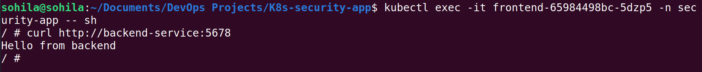
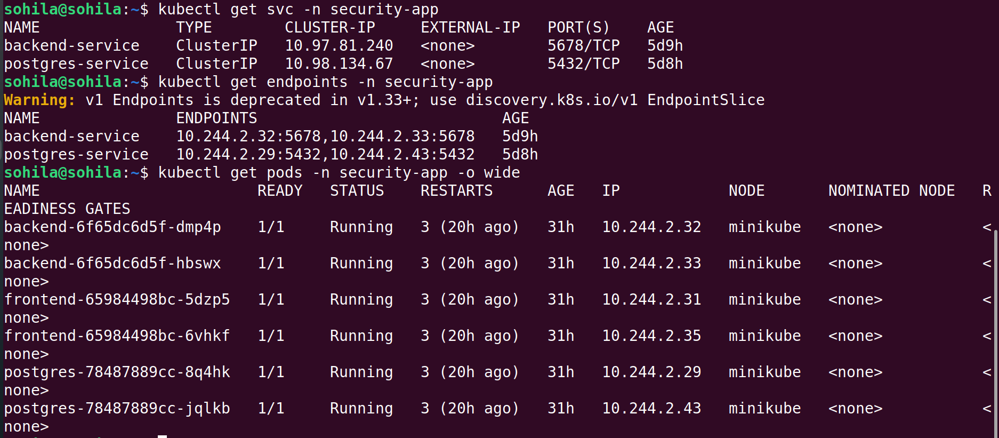
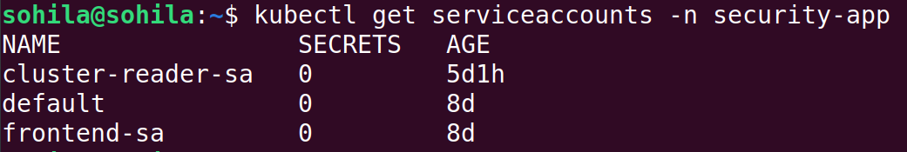
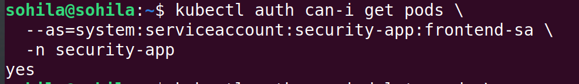
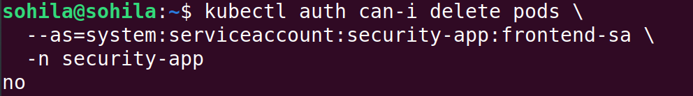
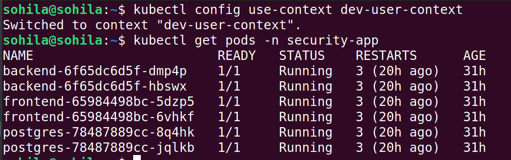
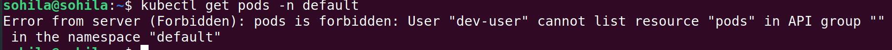
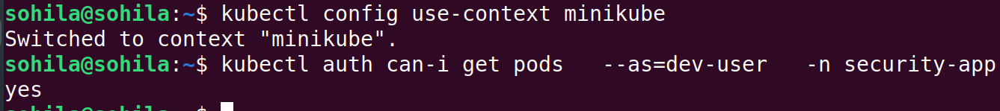
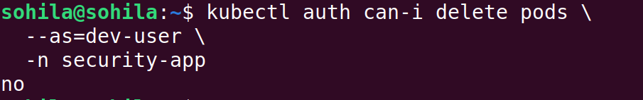

# K8s Security, Storage & Networking Lab

A hands-on Kubernetes administration project built for **CKA preparation** and practical Kubernetes troubleshooting.

The application itself is intentionally simple. The main goal is to demonstrate Kubernetes administration skills through real implementation, testing, failures, troubleshooting, and verification screenshots.

> **Learning method:** Study → Understand → Implement → Break → Troubleshoot → Explain

| | |
|---|---|
| **Namespace** | `security-app` |
| **Cluster** | minikube (single node) |
| **Done** | Services & DNS, ServiceAccounts, RBAC, KubeConfig, client certificates, ConfigMaps, Ingress + TLS |
| **In progress** | Secrets, NetworkPolicies, Storage (PostgreSQL persistence) |
| **Planned** | Security Context, Image Security |

---

## 1. Project Overview

The project contains:

- Frontend using `nginx:alpine` (page served from a ConfigMap)
- Backend using `hashicorp/http-echo:1.0`
- PostgreSQL StatefulSet and Service
- Kubernetes Services and DNS
- ServiceAccounts, RBAC, KubeConfig, client certificate authentication
- ConfigMaps and Secrets
- Ingress with TLS (nginx ingress controller)
- NetworkPolicies
- Storage (StorageClass, PVC, PV)
- Security Context and Image Security (planned)
- Troubleshooting for every lab

The backend intentionally does **not** connect to PostgreSQL. PostgreSQL is used as a target for Kubernetes networking, authentication, secrets, and storage labs.

---

## 2. Architecture

```text
                     Browser / curl
                           |
            https://security-app.local  (TLS)
                           |
                  nginx Ingress Controller
                  (namespace: ingress-nginx)
                           |
              +------------+------------+
              | /api                    | /
       backend-service:5678      frontend-service:80
              |                         |
         Backend Pods              Frontend Pods
        (http-echo:1.0)         (nginx, index.html from ConfigMap)

         postgres-service:5432
                  |
              postgres-0 ---> PVC ---> StorageClass (postgres-storage)
                  ^
        ConfigMap (DB, user) + Secret (password)
```

---

## 3. Project Structure

```text
.
├── config/
│   ├── frontend-config.yaml          # ConfigMap: index.html for nginx
│   └── postgres-config.yaml          # ConfigMap: POSTGRES_DB, POSTGRES_USER
│
├── manifests/
│   ├── namespace.yaml
│   ├── frontend-deployment.yaml
│   ├── frontend-service.yaml         # ClusterIP, port 80
│   ├── backend-deployment.yaml
│   ├── backend-service.yaml          # ClusterIP, port 5678
│   ├── postgres-statefullsets.yaml
│   └── postgres-service.yaml
│
├── networking/
│   └── ingress-controller.yaml       # Ingress with TLS: /api and /
│
├── security/
│   ├── authentication/
│   │   ├── cluster-service-account.yaml
│   │   └── frontend-service-accoutn.yaml
│   │
│   ├── certificates/                 # dev-user and TLS material (keys are git-ignored)
│   │
│   ├── network-policy/
│   │   ├── backend-network-policy.yaml
│   │   ├── frontend-network-policy.yaml
│   │   └── postgres-network-policy.yaml
│   │
│   ├── rbac/
│   │   ├── cluster-pod-reader.yaml
│   │   ├── cluster-rolebinding.yaml
│   │   ├── dev-user-csr.yaml
│   │   ├── dev-user-role.yaml
│   │   ├── dev-user-rolebinding.yaml
│   │   ├── frontend-role.yaml
│   │   └── frontend-rolebinding.yaml
│   │
│   └── security-context/             # planned
│
├── storage/
│   ├── storage-class.yaml            # postgres-storage (minikube-hostpath)
│   └── postgres-pv.yaml              # manual PV from the static provisioning experiment
│
├── tests/
├── screenshots/
└── README.md
```

> **Cleanup TODO**
> - Fix filename typos with `git mv`: `postgres-statefullsets.yaml`, `frontend-service-accoutn.yaml`.
> - The Ingress is named `ingress-controller`, which is misleading because the controller is the set of Pods in `ingress-nginx`. Rename it to `security-app-ingress`.
> - `storage/postgres-pv.yaml` is not needed with dynamic provisioning. Keep it only as a static provisioning example, or remove it.

---

## 4. Setup & Quick Start

**Requirements:** `kubectl`, `minikube`, Docker (or another minikube driver), `openssl`.

Order matters: the namespace, StorageClass, ConfigMaps and Secrets must exist **before** the workloads that use them.

```bash
# 1. Start the cluster (Calico is needed for NetworkPolicies to be enforced)
minikube start --cni=calico
minikube addons enable ingress

# 2. Namespace and storage
kubectl apply -f manifests/namespace.yaml
kubectl apply -f storage/storage-class.yaml

# 3. Configuration
kubectl apply -f config/

# 4. Secrets (NOT stored in Git, create them locally)
kubectl create secret generic postgres-secret \
  --from-literal=POSTGRES_PASSWORD='<choose-a-password>' -n security-app

openssl req -x509 -nodes -days 365 -newkey rsa:2048 \
  -keyout tls.key -out tls.crt -subj "/CN=security-app.local" \
  -addext "subjectAltName=DNS:security-app.local"
kubectl create secret tls security-app-tls --cert=tls.crt --key=tls.key -n security-app

# 5. Workloads
kubectl apply -f manifests/

# 6. Security and networking
kubectl apply -R -f security/authentication/
kubectl apply -R -f security/rbac/
kubectl apply -f networking/ingress-controller.yaml

# 7. Local DNS entry
echo "$(minikube ip) security-app.local" | sudo tee -a /etc/hosts
```

With the docker driver, `minikube ip` may not be reachable from the host. Run `minikube tunnel` in a separate terminal and use `127.0.0.1` in `/etc/hosts` instead.

NetworkPolicies are applied separately, after the app works (see section 16).

### Namespace

```bash
kubectl get namespace security-app
```

```text
NAME           STATUS
security-app   Active
```

### Running Pods

```bash
kubectl get pods -n security-app
```

Expected result:

```text
NAME                         READY   STATUS
backend-...                  1/1     Running
backend-...                  1/1     Running
frontend-...                 1/1     Running
frontend-...                 1/1     Running
postgres-0                   1/1     Running
```

---

## 5. Kubernetes Services

Services provide stable networking between workloads.

```text
Client → Service → Selector → Endpoints → Pod IP → Container Port
```

| Service | Type | Port | Target |
|---|---|---|---|
| `frontend-service` | ClusterIP | 80 | frontend Pods, port 80 |
| `backend-service` | ClusterIP | 5678 | backend Pods, port 5678 |
| `postgres-service` | ClusterIP | 5432 | `postgres-0`, port 5432 |

```bash
kubectl get svc -n security-app
kubectl get endpoints -n security-app
```

All Services are `ClusterIP`. The Ingress is the only entry point from outside.

### Important troubleshooting case

This command failed:

```bash
curl http://backend-service
```

because curl defaults to port 80. The correct command is:

```bash
curl http://backend-service:5678
```

This successfully returned the backend echo response.

**Verification & Screenshots:**



---

## 6. Kubernetes DNS / Service Discovery

Kubernetes Services can be reached through DNS. The Service name is resolved by cluster DNS:

```bash
kubectl run curl-test --rm -it --image=curlimages/curl -n security-app -- \
  curl http://backend-service:5678
```

Useful troubleshooting commands:

```bash
kubectl get svc -n security-app
kubectl get endpoints -n security-app
kubectl get pods -n security-app -o wide
```

The troubleshooting flow is:

```text
DNS → Service → Selector → Endpoints → Pod IP → Container Port
```

**Verification & Screenshots:**



---

## 7. ServiceAccounts

Created ServiceAccounts:

- `frontend-sa`
- `cluster-reader-sa`

```bash
kubectl get serviceaccounts -n security-app
```

ServiceAccounts provide an identity for workloads running inside Kubernetes.

**Verification & Screenshots:**



---

## 8. RBAC

RBAC controls authorization. The project demonstrates:

- Role and RoleBinding
- ClusterRole and ClusterRoleBinding
- namespace-scoped and cluster-scoped permissions
- allowed and denied operations

### Frontend Role

The frontend Role allows:

```yaml
pods:
  get
  list
  watch

services:
  get
  list
```

```bash
kubectl auth can-i get pods \
  --as=system:serviceaccount:security-app:frontend-sa \
  -n security-app
# yes

kubectl auth can-i delete pods \
  --as=system:serviceaccount:security-app:frontend-sa \
  -n security-app
# no
```

**Verification & Screenshots:**




---

## 9. ClusterRole vs Role

A ClusterRole can be referenced by either a ClusterRoleBinding or a RoleBinding.

```text
ClusterRole + RoleBinding
        ↓
Permissions limited to the RoleBinding namespace
```

```text
ClusterRole + ClusterRoleBinding
        ↓
Cluster-wide permissions for applicable resources
```

A previous mistake created `cluster-pod-reader` as `kind: Role` instead of `kind: ClusterRole`. This caused `kubectl get clusterrole cluster-pod-reader` to return `NotFound`. The resource was corrected to `kind: ClusterRole`.

---

## 10. KubeConfig

Practiced:

- clusters, users, contexts and the current context
- namespaces inside contexts
- manual editing of `~/.kube/config`
- ServiceAccount-based context
- client certificate-based context

```bash
kubectl config get-clusters
kubectl config get-users
kubectl config get-contexts
kubectl config current-context
kubectl config view --minify
```

The kubeconfig file was edited manually to understand how **Cluster + User + Context** work together.

---

## 11. Client Certificate Authentication

Client certificate authentication was implemented for `dev-user`. The complete flow:

```text
Private Key → CSR → Kubernetes CertificateSigningRequest → Approval
→ Client Certificate → KubeConfig User → Context → kubectl
```

Certificate files are stored under `security/certificates/`. **Private keys must never be committed to Git.**

### Authentication + Authorization Test

```bash
kubectl config use-context dev-user-context
kubectl get pods -n security-app
```

The command succeeded, which proves the Kubernetes API authenticated the user with the client certificate.

**Verification & Screenshots:**



### Namespace Authorization Test

The same user tried another namespace:

```bash
kubectl get pods -n default
```

```text
Error from server (Forbidden):
pods is forbidden: User "dev-user" cannot list resource "pods"
in the namespace "default"
```

This demonstrates **authentication + RBAC authorization + namespace restriction**.

**Verification & Screenshots:**



---

## 12. dev-user RBAC

The dev-user Role grants access inside `security-app`:

```yaml
pods:         [get, list, watch, create]
deployments:  [get, list, watch, create]
replicasets:  [get, list, watch, create]
```

```bash
kubectl auth can-i get pods    --as=dev-user -n security-app   # yes
kubectl auth can-i delete pods --as=dev-user -n security-app   # no
```

Delete permission was intentionally not granted.

**Verification & Screenshots:**




---

## 13. ConfigMaps

Rule of thumb: **non-sensitive settings go in ConfigMaps, credentials go in Secrets.**

| ConfigMap | Used by | How |
|---|---|---|
| `postgres-config` | `postgres-0` | `envFrom` → `POSTGRES_DB`, `POSTGRES_USER` |
| `frontend-configmap` | frontend Pods | volume mounted (read-only) at `/usr/share/nginx/html` |

```bash
kubectl apply -f config/
kubectl get configmap -n security-app
kubectl exec postgres-0 -n security-app -- env | grep POSTGRES
kubectl exec deploy/frontend -n security-app -- cat /usr/share/nginx/html/index.html
```

### Behaviors worth remembering (CKA)

| Source | Consumed as | Updates in a running Pod? |
|---|---|---|
| ConfigMap / Secret | volume | **Yes**, after about a minute |
| ConfigMap / Secret | env var | **No**, needs `kubectl rollout restart` |

- A wrong ConfigMap name gives `CreateContainerConfigError`. Diagnose with `kubectl describe pod`.
- Mounting a ConfigMap over `/usr/share/nginx/html` replaces the whole directory, so only the keys in the ConfigMap are served.

**Verification & Screenshots:**

<!--  -->
<!--  -->

---

## 14. Kubernetes Secrets

The PostgreSQL password was moved out of the StatefulSet into the `postgres-secret` Secret, consumed with `envFrom` (`secretRef`).

The Secret is created manually (see Quick Start) and `postgres-secret.yaml` is git-ignored, so **no credentials live in the repository**.

```bash
kubectl get secrets -n security-app
kubectl describe secret postgres-secret -n security-app
```

Topics covered or planned:

- Secret creation from the command line
- Secret consumption as environment variables
- Secret volumes (planned)
- troubleshooting missing Secret references (`CreateContainerConfigError`)

### Things to remember

- Secrets are base64-encoded, **not encrypted**, unless encryption at rest is configured. Restrict `get secrets` with RBAC.
- Postgres reads `POSTGRES_PASSWORD` only when it initializes an empty data directory. Changing the Secret later does not change the database password.
- Never show Secret values in screenshots.

**Verification & Screenshots:**

<!--  -->
<!--  -->

---

## 15. Ingress & TLS

An Ingress needs a **controller** to act on it. minikube provides ingress-nginx as an addon:

```bash
minikube addons enable ingress
kubectl get pods -n ingress-nginx
kubectl get ingressclass
```

### Routing

| Host | Path | Backend |
|---|---|---|
| `security-app.local` | `/api` | `backend-service:5678` |
| `security-app.local` | `/` | `frontend-service:80` |

### TLS

The Ingress terminates TLS with the `security-app-tls` Secret (self-signed, `CN=security-app.local`). Plain HTTP receives a **308 redirect** to HTTPS.

```bash
kubectl apply -f networking/ingress-controller.yaml
kubectl describe ingress ingress-controller -n security-app   # both paths + TLS section
curl -kI http://security-app.local/                           # 308 redirect
curl -k  https://security-app.local/                          # frontend page
curl -k  https://security-app.local/api                       # backend echo
curl -kv https://security-app.local 2>&1 | grep -E "subject:|issuer:"
```

If the TLS Secret is missing, nginx serves its built-in "Kubernetes Ingress Controller Fake Certificate".

Test without editing `/etc/hosts`:

```bash
curl -k --resolve security-app.local:443:$(minikube ip) https://security-app.local/api
```

**Verification & Screenshots:**

<!--  -->
<!--  -->

---

## 16. NetworkPolicies

Policies are written in `security/network-policy/`:

- `frontend-network-policy.yaml`
- `backend-network-policy.yaml`
- `postgres-network-policy.yaml`

Target traffic model:

```text
Ingress controller → Frontend → Backend → PostgreSQL
Frontend -X-> PostgreSQL (blocked)
```

The goal is to understand:

- ingress and egress rules
- pod and namespace selectors
- default-deny behavior
- troubleshooting blocked traffic

> **Important**
> - The frontend policy must allow traffic from the `ingress-nginx` namespace, otherwise the Ingress returns `504`.
> - The CNI must enforce policies. Start minikube with `--cni=calico`, otherwise policies are silently ignored.

```bash
kubectl get networkpolicy -n security-app
kubectl describe networkpolicy <policy-name> -n security-app
```

**Verification & Screenshots:**

<!--  -->
<!--  -->
<!--  -->

---

## 17. Storage

**Goal:** persist PostgreSQL data with a StorageClass, PVC and PV.

```text
Pod → PVC → PV → StorageClass → Storage Backend (minikube hostPath)
```

```yaml
apiVersion: storage.k8s.io/v1
kind: StorageClass
metadata:
  name: postgres-storage
provisioner: k8s.io/minikube-hostpath
reclaimPolicy: Retain
volumeBindingMode: Immediate
```

The StatefulSet requests storage through `volumeClaimTemplates` with `storageClassName: postgres-storage`. The PVC `postgres-data-postgres-0` is created automatically and a PV is provisioned dynamically.

```bash
kubectl get sc
kubectl get pv
kubectl get pvc -n security-app        # expect: Bound
kubectl get pods -n security-app       # expect: postgres-0 Running
kubectl describe pvc postgres-data-postgres-0 -n security-app
```

Topics to finish:

- persistence test: write data, delete `postgres-0`, confirm the data survives
- access modes and reclaim policies
- static provisioning (manual PV) vs dynamic provisioning
- `emptyDir` comparison

**Verification & Screenshots:**

<!--  -->
<!--  -->
<!--  -->

---

## 18. Security Context (planned)

Security Context controls how containers and Pods run.

Planned workflow:

```text
Run container as root → Verify UID → Apply non-root securityContext
→ Verify UID again → Intentionally break → Troubleshoot
```

Topics to demonstrate:

- `runAsUser`, `runAsGroup`, `runAsNonRoot`
- Pod-level vs container-level settings
- read-only root filesystem and dropped capabilities

---

## 19. Image Security (planned)

- image tags vs digests
- image pull policy and pull behavior
- avoiding unnecessary privileged containers
- understanding image-related Pod failures (`ImagePullBackOff`, `ErrImagePull`)

```bash
kubectl describe pod <pod-name> -n security-app
kubectl get pod <pod-name> -n security-app -o yaml
```

---

## 20. Troubleshooting Log

This project intentionally records failures because troubleshooting is an important part of CKA preparation. Each entry: **symptom → cause → fix**.

### Service port mistake
- **Symptom:** `curl http://backend-service` fails.
- **Cause:** curl defaults to port 80, but the backend listens on 5678.
- **Fix:** `curl http://backend-service:5678`.

### RBAC resource name mistake
- **Symptom:** `kubectl auth can-i get pods --as=dev-user -n security-app` returned `no`.
- **Cause:** the Role used `resources: [pod]` instead of `pods`.
- **Fix:** use the plural resource name, then re-test (`yes`).

### Role vs ClusterRole mistake
- **Symptom:** `kubectl get clusterrole cluster-pod-reader` returned `NotFound`.
- **Cause:** the manifest had `kind: Role` instead of `kind: ClusterRole`.
- **Fix:** correct the `kind` and re-apply.

### Limited context vs admin context
- **Symptom:** a ServiceAccount context could not modify RBAC resources.
- **Cause:** it is not authorized to (working as designed).
- **Fix:** switch to the admin minikube context for cluster configuration changes.

```text
Authentication identity → Authorization permissions → Allowed Kubernetes operations
```

### PVC and Pod stuck in `Pending`
- **Symptom:** `postgres-0` is `Pending` with `pod has unbound immediate PersistentVolumeClaims`.
- **Cause:** the PVC asked for `storageClassName: postgres-storage`, which did not exist. The manual PV `postgres-pv` had no class, so it could not match either.
- **Diagnose:** `kubectl describe pvc postgres-data-postgres-0 -n security-app`, `kubectl get sc`, `kubectl get pv`.
- **Fix:** create the StorageClass so dynamic provisioning creates the PV.

### StorageClass manifest rejected
- **Symptom:** `no matches for kind "StorageClassName" in version "v1"`.
- **Cause:** wrong `kind` (`StorageClassName` is a PVC field, not a resource) and wrong `apiVersion`.
- **Fix:** `apiVersion: storage.k8s.io/v1` and `kind: StorageClass`.
- **Tip:** `kubectl api-resources | grep -i storage` and `kubectl explain storageclass`.

> `volumeClaimTemplates` cannot be edited on an existing StatefulSet. Delete the StatefulSet (and its PVC) and re-apply.

### Ingress `/api` returned 404
- **Symptom:** `curl http://security-app.local/api` returned a 404 from nginx, and `kubectl describe ingress` showed only the `/` rule.
- **Cause:** the second path entry had no leading `- `, so its keys overwrote the first entry (duplicate YAML keys, last one wins). No error was reported.
- **Fix:** every path starts with `- `. Always compare `kubectl describe ingress` with the rules you wrote, and use `kubectl apply --dry-run=server` before applying.

### Frontend page not changing after adding the ConfigMap
Diagnosis checklist, from the Pod outward:

1. `kubectl describe configmap frontend-configmap -n security-app`: does the key `index.html` exist?
2. `kubectl get pods -l app=frontend -n security-app`: are the Pods new (check AGE) after the Deployment change?
3. `kubectl describe pod <pod> -n security-app`: is the ConfigMap volume mounted at `/usr/share/nginx/html`?
4. `kubectl exec deploy/frontend -n security-app -- cat /usr/share/nginx/html/index.html`: is the content there?
5. `curl -k https://security-app.local/` and a private browser window, to rule out browser cache.

---

## 21. Screenshots

Screenshots are part of the project documentation. Each important lab should contain:

- the command
- the actual terminal result
- a screenshot proving the result
- a short explanation of what the result demonstrates

Recommended structure:

```text
screenshots/
├── application/
├── authentication/
├── rbac/
├── kubeconfig/
├── configmap/
├── secrets/
├── ingress/
├── network-policy/
├── storage/
├── security-context/
└── networking/
```

Screenshot guidelines:

- show the relevant command and the actual result
- avoid unnecessary terminal output
- **never expose passwords, tokens, private keys, or Secret values**
- use descriptive filenames
- embed images with ``, not just as links
- keep an image link commented out (`<!-- ... -->`) until the file exists, so GitHub does not show a broken image

---

## 22. CKA Skills Covered

### Security
- [x] ServiceAccounts
- [x] Role / RoleBinding
- [x] ClusterRole / ClusterRoleBinding
- [x] KubeConfig
- [x] Client certificate authentication (CSR API)
- [x] Secrets (wired into PostgreSQL, verification pending)
- [x] NetworkPolicies (written, verification pending)
- [ ] Security Context
- [x] Image Security

### Configuration
- [x] ConfigMap as environment variables
- [x] ConfigMap as a volume

### Networking
- [x] Services, selectors, endpoints
- [x] DNS / Service Discovery
- [x] Ingress (path routing)
- [x] Ingress TLS
- [ ] NetworkPolicies
- [ ] Pod networking

### Storage
- [x] StorageClass
- [x] PersistentVolume
- [x] PersistentVolumeClaim
- [x] Dynamic provisioning
- [x] Access modes
- [x] Reclaim policies
- [ ] emptyDir
- [ ] PostgreSQL persistence

### Troubleshooting
- [x] Service connectivity and ports
- [x] RBAC and namespace permissions
- [x] Authentication vs authorization
- [x] Ingress routing
- [x] Storage
- [x] NetworkPolicy
- [x] Pod security

---

## 23. Security Notes

- **Never commit private keys.** `.gitignore` covers `dev-user.key`, `tls.key` and `postgres-secret.yaml`. Consider also ignoring `*.key` and `*.csr`. If a key was ever pushed, it stays in Git history, so regenerate it.
- The repository contains **no database password**; `postgres-secret` is created manually.
- The TLS certificate is self-signed and for local use only.
- Kubernetes Secrets are only base64-encoded unless encryption at rest is configured.

---

## 24. Final Project Goal

The final project should demonstrate the complete flow:

```text
Authentication → KubeConfig → Authorization / RBAC → Client Certificates
→ ConfigMaps → Secrets → Security Context → Image Security
→ NetworkPolicy → Services / DNS → Ingress + TLS → Storage
→ Troubleshooting → Verification screenshots
```

The project is intentionally built as a living CKA lab. Every new topic is documented with:

```text
Study → Understand → Implement → Test → Break → Troubleshoot
→ Capture screenshots → Explain
```

The objective is CKA-level operational understanding, not command memorization.
